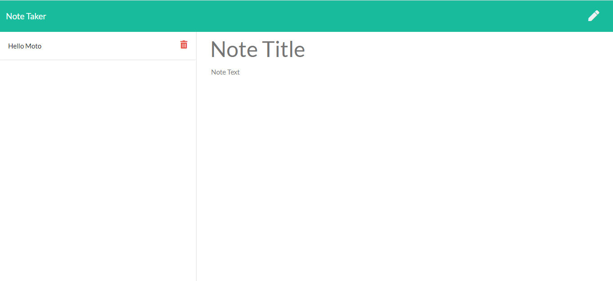

# noteTaker

## Description

For users that need to keep track of a lot of information, it's easy to forget or be unable to recall something important. Being able to take persistent notes allows users to have written information available when needed. This will allow user to add, save and delete notes.

* [The URL of the deployed application](https://mysterious-lake-34111.herokuapp.com/)

* [The URL of the GitHub repository](https://github.com/Findjules2/noteTaker)

 -->